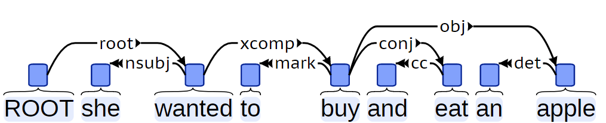
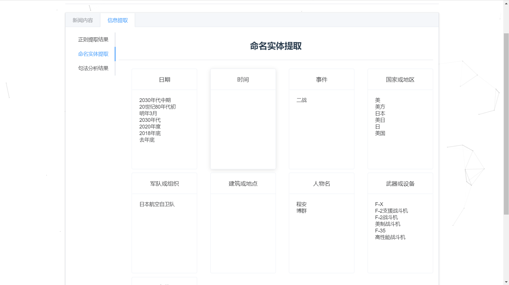
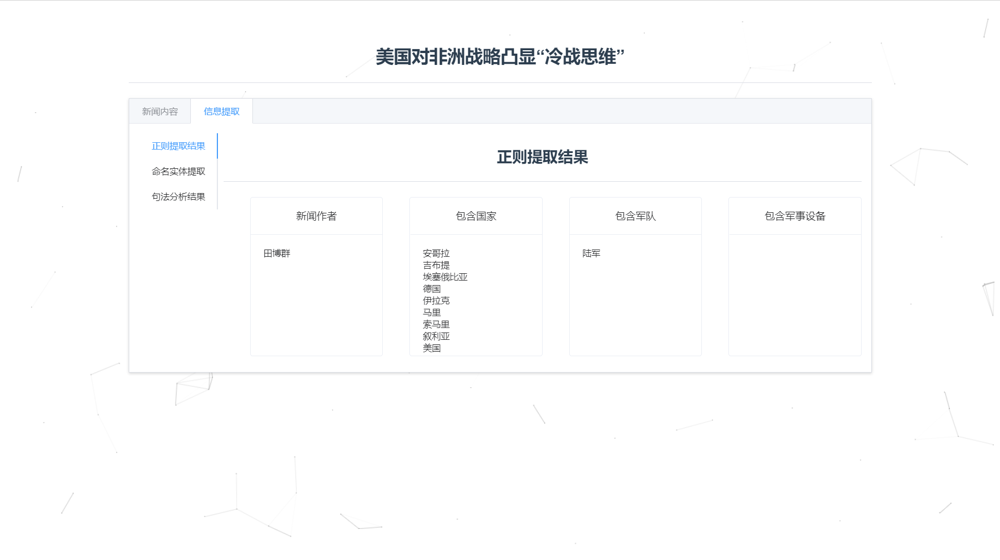

#### 算法优化：

```
   #按照value降序排序，得到一个list
    #考虑时间因素,即用上述的相似度再加上5/(当前时间-文章时间)
    for element in textDict.items():
        sql_query1 = "SELECT * FROM `search_result` WHERE iindex=" + str(element[0])
        cur.execute(sql_query1)
        Result = cur.fetchall()
        if len(Result) > 0:
            dd = datetime.datetime.strptime(Result[0][3], "%Y-%m-%d")
            today = datetime.datetime.now()
            delta=today-dd;
            extra= 5/delta.days;
            textDict[element[0]]=textDict[element[0]]+extra;


```

​		考虑到我们爬取的文档目标是军事新闻类别，因而新闻的新鲜度也是一个重要的参考指标。经过多次实践，我们将x=5/(当前时间-文章发表时间)这个量加入到搜索结果排序中的考量中去，即与已经得到的排序因子相加，得到新的排序因子。


#### 正则表达式提取：

```


#正则表达式匹配，设置一个含有正则表达式字符串列表进行循环匹配

writer=['【*】','电 (*)'];
time0=['[0-9]+-[0-9]+-[0-9]+'];

def writer(content):
    ans=re.findall(r'【编辑:(.*)】',content);
    if len(ans) > 0:
        return ans;
    else:
        ans=re.findall(r'电 \((.+)\)',content);
        return ans;

def time0(content):
    ans=re.findall(r'([0-9]+-[0-9]+-[0-9]+)',content);
    return ans;

```

考虑到时间格式的特殊性，和许多文章中的作者署名格式。我们利用正则表达式对文章作者和时间进行提取


#### 提取关键信息：

```

def equipments(content):#军事装备名称文件包括搜狗语料库，维基百科，新东方军事方面英语词汇翻译
    f=open("mil_names.txt","r",encoding="utf-8")
    data=f.readlines()
    f.close();
    ans=[]
    for i in data:
        i = i.rstrip("\n")
        if i in content and i not in ans:
            ans.append(i)
    return ans;


def countries(content):#国家名称
    f=open("countries.txt","r",encoding="utf-8")
    data=f.readlines()
    f.close();
    ans=[]
    for i in data:
        i = i.rstrip("\n")
        if i in content and i not in ans:
            ans.append(i)
    return ans;


def army_kinds(content):#军队类型
    f=open("army_kinds.txt","r",encoding="utf-8")
    data=f.readlines()
    f.close();
    ans=[]
    for i in data:
        i = i.rstrip("\n")
        if i in content and i not in ans:
            ans.append(i)
    return ans;

```

​		我们认为军队类型，国家名称，军事装备名称都是用户从军事新闻搜索引擎中的关注信息点。所以我们利用从网上归纳的文档，来对文章中的相关内容进行提取。


## Stanza包 - 斯坦福大学NLP组深度学习自然语言处理工具

Stanza 是一个纯Python实现的自然语言处理工具包，这个区别于斯坦福大学自然语言处理组之前一直维护的Java实现 CoreNLP 等自然语言处理工具包，对于Python用户来说，就更方便调用了，并且Stanza还提供了一个Python接口可用于CoreNLP的调用 ，对于一些没有在Stanza中实现的NLP功能，可以通过这个接口调用 CoreNLP 作为补充。 Stanza的深度学习自然语言处理模块基于PyTorch实现，用户可以基于自己标注的数据构建更准确的神经网络模型用于训练、评估和使用，当然，如果有GPU机器加持，速度可以更快。Stanza目前支持66种语言的文本分析，包括自动断句、Tokenize(或者分词）、词性标注和形态素分析、依存句法分析以及命名实体识别。


### 基本框架-Pipeline

Pipeline是Stanza里的一个重要概念，在Stanza 中，我们通过通过pipeline预加载不同语言的模型，也可以通过pipeline选择不同的处理模块，还可以选择是否使用GPU。


Pipeline的用法如下：

| Option                    | Type            | Default                | Description                                                  |
| ------------------------- | --------------- | ---------------------- | ------------------------------------------------------------ |
| lang                      | `str`           | `'en'`                 | Language code (e.g., `"en"`) or language name (e.g., `"English"`) for the language to process with the Pipeline. You can find a complete list of available languages [here](https://stanfordnlp.github.io/stanza/models.html). |
| dir                       | `str`           | `'~/stanza_resources'` | Directory for storing the models downloaded for Stanza. By default, Stanza stores its models in a folder in your home directory. |
| package                   | `str`           | `'default'`            | Package to use for processors, where each package typically specifies what data the models are trained on. We provide a “default” package for all languages that contains NLP models most users will find useful. A complete list of available packages can be found [here](https://stanfordnlp.github.io/stanza/models.html). |
| processors                | `dict` or `str` | `dict()`               | [Processor](https://stanfordnlp.github.io/stanza/pipeline.html#processors)s to use in the Pipeline. This can either be specified as a comma-seperated list of processor names to use (e.g., `'tokenize,pos'`), or a Python dictionary with Processor names as keys and packages as corresponding values (e.g., `{'tokenize': 'ewt', 'pos': 'ewt'}`). In the case of a dict, all unspecified Processors will fall back to using the package specified by the `package` argument. To ensure that only the processors you want are loaded when using a dict, set `package=None` as well. A list of all Processors supported can be found [here](https://stanfordnlp.github.io/stanza/pipeline.html#processors). |
| logging_level             | `str`           | `'INFO'`               | Controls the level of logging information to display when the Pipeline is instantiated and run. Can be one of `'DEBUG'`, `'INFO'`, `'WARN'`, `'ERROR'`, `'CIRTICAL'`, or `'FATAL'`. Less and less information will be displayed from `'DEBUG'` to `'FATAL'`. |
| verbose                   | `str`           | `None`                 | Simplified option for logging level. If `True`, logging level will be set to `'INFO'`. If `False`, logging level will be set to `'ERROR'`. |
| use_gpu                   | `bool`          | `True`                 | Attempt to use a GPU if available. Set this to `False` if you are in a GPU-enabled environment but want to explicitly keep Stanza from using the GPU. |
| kwargs                    | -               | -                      | Options for each of the individual processors. See the individual processor pages for descriptions. |
| {processor}_model_path    | -               | -                      | Path to load an alternate model. For example, `pos_model_path=xyz.pt` to load `xyz.pt` for the pos processor. |
| {processor}_pretrain_path | -               | -                      | For processors which use word vectors, path to load an alternate set of word vectors. For example, `pos_pretrain_path=abc.pt` to load the `abc.pt` pretrain for the pos processor. Will not work for NER, which has the vectors saved with the model. |


### 支持的处理器-Processors

处理器（processors）是执行特定 NLP 功能并为‎`‎文档‎`创建不同注释的pipeline单元，向pipeline注入不同的processors，能够得到不同的分析结果pipeline支持以下处理器：

| Name     | Processor class name | Requirement               | Generated Annotation                                         | Description                                                  |
| -------- | -------------------- | ------------------------- | ------------------------------------------------------------ | ------------------------------------------------------------ |
| tokenize | Tokenize­Processor   | -                         | Segments a [`Document`](https://stanfordnlp.github.io/stanza/data_objects.html#document) into [`Sentence`](https://stanfordnlp.github.io/stanza/data_objects.html#sentence)s, each containing a list of [`Token`](https://stanfordnlp.github.io/stanza/data_objects.html#token)s. This processor also predicts which tokens are multi-word tokens, but leaves expanding them to the [MWTProcessor](https://stanfordnlp.github.io/stanza/mwt.html). | Tokenizes the text and performs sentence segmentation.       |
| mwt      | MWT­Processor        | tokenize                  | Expands multi-word tokens (MWTs) into multiple words when they are predicted by the tokenizer. Each [`Token`](https://stanfordnlp.github.io/stanza/data_objects.html#token) will correspond to one or more [`Word`](https://stanfordnlp.github.io/stanza/data_objects.html#word)s after tokenization and MWT expansion. | Expands [multi-word tokens (MWT)](https://universaldependencies.org/u/overview/tokenization.html) predicted by the [TokenizeProcessor](https://stanfordnlp.github.io/stanza/tokenize.html). This is only applicable to some languages. |
| pos      | POS­Processor        | tokenize, mwt             | UPOS, XPOS, and UFeats annotations are accessible through [`Word`](https://stanfordnlp.github.io/stanza/data_objects.html#word)’s properties `pos`, `xpos`, and `ufeats`. | Labels tokens with their [universal POS (UPOS) tags](https://universaldependencies.org/u/pos/), treebank-specific POS (XPOS) tags, and [universal morphological features (UFeats)](https://universaldependencies.org/u/feat/index.html). |
| lemma    | Lemma­Processor      | tokenize, mwt, pos        | Perform [lemmatization](https://en.wikipedia.org/wiki/Lemmatisation) on a [`Word`](https://stanfordnlp.github.io/stanza/data_objects.html#word) using the `Word.text` and `Word.upos` values. The result can be accessed as `Word.lemma`. | Generates the word lemmas for all words in the Document.     |
| depparse | Depparse­Processor   | tokenize, mwt, pos, lemma | Determines the syntactic head of each word in a sentence and the dependency relation between the two words that are accessible through [`Word`](https://stanfordnlp.github.io/stanza/data_objects.html#word)’s `head` and `deprel` attributes. | Provides an accurate syntactic dependency parsing analysis.  |
| ner      | NER­Processor        | tokenize, mwt             | Named entities accessible through [`Document`](https://stanfordnlp.github.io/stanza/data_objects.html#document) or [`Sentence`](https://stanfordnlp.github.io/stanza/data_objects.html#sentence)’s properties `entities` or `ents`. Token-level NER tags accessible through [`Token`](https://stanfordnlp.github.io/stanza/data_objects.html#token)’s properties `ner`. | Recognize named entities for all token spans in the corpus.  |

在这里，我们为了实现依存句法与命名实体识别分析，需要用到`depparse` 与 `ner` 两个处理器。


### 依存句法-depparse

语法分析(syntactic parsing )是自然语言处理中一个重要的任务，其目标是分析句子的语法结构并将其表示为容易理解的结构(通常是树形结构)。同时，语法分析也是所有工具性NLP任务中较为高级、较为复杂的一种任务。语法分析有短语结构树和依存句法树两种语法形式，本次实验中我们重点使用依存句法树。

#### 依存句法树

依存句法树关注的是句子中词语之间的语法联系，并且将其约束为树形结构。依存语法理论认为词与词之间存在主从关系，这是一种二元不等价的关系。在句子中，如果一个词修饰另一个词，则称修饰词为从属词( dependent )，被修饰的词语称为支配词(head),两者之间的语法关系称为依存关系( dependency relation)。比如句子“大梦想”中形容词“大”与名词“梦想”之间的依存关系如图所示:


图中的箭头方向由支配词指向从属词，这是可视化时的习惯。将一个句子中所有词语的依存关系以有向边的形式表示出来，就会得到一棵树，称为**依存句法树**( dependency parse tree)。比如句子“弱小的我也有大梦想”的依存句法树如图所示。


现代依存语法中，语言学家 Robinson 对依存句法树提了 4 个约束性的公理。

- 有且只有一个词语(ROOT，虚拟根节点，简称虚根)不依存于其他词语。

- 除此之外所有单词必须依存于其他单词。

- 每个单词不能依存于多个单词。

- 如果单词 A 依存于 B，那么位置处于 A 和 B 之间的单词 C 只能依存于 A、B 或 AB 之间的单词。

这 4 条公理分别约束了依存句法树(图的特例)的根节点唯一性、 连通、无环和投射性( projective )。这些约束对语料库的标注以及依存句法分析器的设计奠定了基础。


#### 依存句法分析

**依存句法分析**( dependency parsing )指的是分析句子的依存语法的一种中高级 NLP任务，其输人通常是词语和词性，输出则是一棵依存句法树。 

1. 基于图的依存句法分析

   正如树是图的特例一样，依存句法树其实是完全图的一个子图。如果为完全图中的每条边是否属于句法树的可能性打分，然后就可以利用 Prim 之类的算法找出最大生成树( MST )作为依存句法树了。这样将整棵树的分数分解( factorize )为每条边上的分数之和，然后在图上搜索最优解的方法统称为基于图的算法。

   在传统机器学习时代，基于图的依存句法分析器往往面临运行开销大的问题。这是由于传统机器学习所依赖的特征过于稀疏，训练算法需要在整个图上进行全局的结构化预测等。考虑到这些问题，另一种基于转移的路线在传统机器学习框架下显得更加实用。

2. 基于转移的依存句法分析

   我们以“人 吃 鱼”这个句子为例子，手动构建依存句法树。

   从“吃”连线到“人”建立依存关系，主谓关系。
   从“吃”连线到“鱼”建立依存关系，动宾关系。
   如此，我们将一棵依存句法树的构建过程表示为两个动作。如果机器学习模型能够根据句子的某些特征准确地预测这些动作，那么计算机就能够根据这些动作拼装出正确的依存句法树了。这种拼装动作称为转移( transition),而这类算法统称为基于转移的依存句法分析。

   

我们是用Stanza的`depparse`用于分析依存句法，`depparse`模块从输入句构建单词的树结构，表示单词之间的语法依赖关系。由此产生的树表示，遵循 [Universal Dependencies formalism](https://universaldependencies.org/)（以下简称UD）。

UD 方案中的语法注释包括单词之间的类型依赖关系。基本依赖表示形式为一棵树，其中一个词正好是句子的头，依赖于名义上的 ROOT，所有其他词依赖于句子中的另一个词，如下例所示




除了所有UD树库必须的基本依赖性表示之外，还有可能提供增强的依赖性表示，以便为语义解释提供更完整的基础。增强的表示一般不是一棵树，而是一般图形结构，如下所示中，蓝色的依赖关系。


在这里，我们仅仅使用增强`depparse`分析出的增强依赖性关系，用于描述信息提取中关键词间的关系。

其中，可能出现的所有关系如下：

关系表示

abbrev: abbreviation modifier，缩写
acomp: adjectival complement，形容词的补充；
advcl : adverbial clause modifier，状语从句修饰词
advmod: adverbial modifier状语
agent: agent，代理，一般有by的时候会出现这个
amod: adjectival modifier形容词
appos: appositional modifier,同位词
attr: attributive，属性
aux: auxiliary，非主要动词和助词，如BE,HAVE SHOULD/COULD等到
auxpass: passive auxiliary 被动词
cc: coordination，并列关系，一般取第一个词
ccomp: clausal complement从句补充
complm: complementizer，引导从句的词好重聚中的主要动词
conj : conjunct，连接两个并列的词。
cop: copula。系动词（如be,seem,appear等），（命题主词与谓词间的）连系
csubj : clausal subject，从主关系
csubjpass: clausal passive subject 主从被动关系
dep: dependent依赖关系
det: determiner决定词，如冠词等
dobj : direct object直接宾语
expl: expletive，主要是抓取there
infmod: infinitival modifier，动词不定式
iobj : indirect object，非直接宾语，也就是所以的间接宾语；
mark: marker，主要出现在有“that” or “whether”“because”, “when”,
mwe: multi-word expression，多个词的表示
neg: negation modifier否定词
nn: noun compound modifier名词组合形式
npadvmod: noun phrase as adverbial modifier名词作状语
nsubj : nominal subject，名词主语
nsubjpass: passive nominal subject，被动的名词主语
num: numeric modifier，数值修饰
number: element of compound number，组合数字
parataxis: parataxis: parataxis，并列关系
partmod: participial modifier动词形式的修饰
pcomp: prepositional complement，介词补充
pobj : object of a preposition，介词的宾语
poss: possession modifier，所有形式，所有格，所属
possessive: possessive modifier，这个表示所有者和那个’S的关系
preconj : preconjunct，常常是出现在 “either”, “both”, “neither”的情况下
predet: predeterminer，前缀决定，常常是表示所有
prep: prepositional modifier
prepc: prepositional clausal modifier
prt: phrasal verb particle，动词短语
punct: punctuation，这个很少见，但是保留下来了，结果当中不会出现这个
purpcl : purpose clause modifier，目的从句
quantmod: quantifier phrase modifier，数量短语
rcmod: relative clause modifier相关关系
ref : referent，指示物，指代
rel : relative
root: root，最重要的词，从它开始，根节点
tmod: temporal modifier
xcomp: open clausal complement
xsubj : controlling subject 掌控者


### 命名实体识别-ner

#### 概念

命名实体识别（Named Entity Recognition，简称NER），又称作“专名识别”，是指识别文本中具有特定意义的实体，主要包括人名、地名、机构名、专有名词等。简单的讲，就是识别自然文本中的实体指称的边界和类别。


#### 发展历史

命名实体识别这个术语首次出现在 MUC-6（Message Understanding Conferences），这个会议关注的主要问题是信息抽取（Information Extraction），第六届 MUC 除了信息抽取评测任务还开设了新评测任务即命名实体识别任务。

除此之外，其他相关的评测会议包括CoNLL（Conference on Computational Natural Language Learning）、ACE（Automatic Content Extraction）和IEER（Information Extraction-Entity Recognition Evaluation）等。

在MUC-6之前，大家主要是关注人名、地名和组织机构名这三类专业名词的识别。自MUC-6起，后面有很多研究对类别进行了更细致的划分，比如地名被进一步细化为城市、州和国家，也有人将人名进一步细分为政治家、艺人等小类。

此外，一些评测还扩大了专业名词的范围，比如CoNLL某年组织的评测中包含了产品名的识别。一些研究也涉及电影名、书名、项目名、研究领域名称、电子邮件地址、电话号码以及生物信息学领域的专有名词（如蛋白质、DNA、RNA等）。甚至有一些工作不限定“实体”的类型，而是将其当做开放域的命名实体识别和分类。


#### 常见方法

早期的命名实体识别方法基本都是基于规则的。之后由于基于大规模的语料库的统计方法在自然语言处理各个方面取得不错的效果之后，一大批机器学习的方法也出现在命名实体类识别任务。宗成庆老师在统计自然语言处理一书粗略的将这些基于机器学习的命名实体识别方法划分为以下几类：

有监督的学习方法：这一类方法需要利用大规模的已标注语料对模型进行参数训练。目前常用的模型或方法包括隐马尔可夫模型、语言模型、最大熵模型、支持向量机、决策树和条件随机场等。值得一提的是，基于条件随机场的方法是命名实体识别中最成功的方法。

半监督的学习方法：这一类方法利用标注的小数据集（种子数据）自举学习。

无监督的学习方法：这一类方法利用词汇资源（如 WordNet）等进行上下文聚类。

混合方法：几种模型相结合或利用统计方法和人工总结的知识库。

值得一提的是，由于深度学习在自然语言的广泛应用，基于深度学习的命名实体识别方法也展现出不错的效果，此类方法基本还是把命名实体识别当做序列标注任务来做，比较经典的方法是 LSTM+CRF、BiLSTM+CRF。


#### Stanford NER

斯坦福大学开发的基于条件随机场的命名实体识别系统，该系统参数是基于 CoNLL、MUC-6、MUC-7 和 ACE 命名实体语料训练出来的。

对于军事信息文本，我们选择以下几种有价值的命名实体类别：

DATE：日期
TIME：时间
EVENT：事件
GPE：国家或地区
ORG：军队或组织
FAC：建筑或地点
PERSON：人物名
PRODUCT：武器或设备
LAW：条约


## 利用Stanza提取信息

### 提取依存句法

```python
def Exist(word):
    global index
    for keyword in keywords[index]:
        if (word == keyword):
            return True
    return False
id = 0
index = 0

def fetch_keyword():
    # 连接数据库
    try:
        conn = pymysql.connect(host='122.9.42.19'  # 连接名称，默认127.0.0.1
                               , user='root'  # 用户名
                               , passwd='Info2021'  # 密码
                               , port=3306  # 端口，默认为3306
                               , db='information'  # 数据库名称
                               , charset='utf8'  # 字符编码
                               )
        cur = conn.cursor()  # 生成游标对象
    except:
        print("disconnect")

    sql_query = "SELECT * FROM `inverted_index_20`"
    cur.execute(sql_query)
    searchResult = cur.fetchall()
    wordList = []
    for i in range(2010):
        wordList.append([])
    for row in searchResult:
        print("building keywords:",row[1])
        wordList[row[1]].append(row[2])
    cur.close()
    conn.close()
    return wordList

zh_nlp = stanza.Pipeline('zh', processors='tokenize,pos,lemma,depparse,ner', verbose=True, use_gpu=True)
w = open("entity_result_all.csv", "w")
keywords = fetch_keyword()
dirpath="data/news/mil"
for root, dirs, files in os.walk(dirpath):
    for f in files:
        rela_set=set()
        for sent in zh_doc.sentences:
            for word in sent.words:
                if (Exist(word.text) and word.head > 0 and Exist(sent.words[word.head-1].text) and word.text != sent.words[word.head-1].text):
                    rela_set.add(word.text + ',' +sent.words[word.head-1].text + ',' + word.deprel) #from,to,type
        for ent in ent_set:
            print(ent)
        for rela in rela_set:
            id = id + 1
            w.write(str(id) + ',' + str(index) + ',' + rela + '\n')
        f.close()
w.close()
```

在这里，我们首先利用了实验二得到的TF-IDF模型，提取出最能代表每篇文章的20个关键词。之后，再使用Stanza提取关键词之间的句法关系集合，只保留关系中包含TF-IDF关键词的。这样，我们就得到了这20个最重要的关键词之间的关系。


### 提取命名实体

```python
zh_nlp = stanza.Pipeline('zh', processors='tokenize,pos,lemma,depparse,ner', verbose=True, use_gpu=True)
w = open("entity_result_all.csv", "w")
keywords = fetch_keyword()
dirpath="data/news/mil"
for root, dirs, files in os.walk(dirpath):
    for f in files:
        path = os.path.join(root, f)
        f = open(path, 'r')
        text = f.read()
        zh_doc = zh_nlp(text)
        ent_set =set()
        for sent in zh_doc.sentences:
            for ent in sent.ents:
                ent_set.add(ent.text + ',' + ent.type)

        for ent in ent_set:
            id = id + 1
            w.write(str(id) + ',' + str(index) + ',' + ent + '\n')
w.close()
```


提取命名实体在使用stanza模型下变的十分轻松，在zh_doc的分析结果中遍历ents即可得到实体与他们的类型。


## 效果截图

### 文章1





### 文章2


	


### 文章3





### 文章4


