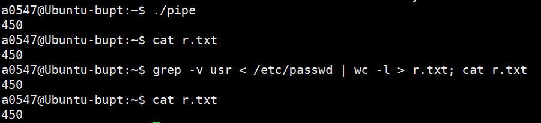

# 第四次作业 模仿bash功能，编程实现管道与重定向

[TOC]


##  一、实验题目

使用fork(), exec(), dup2(), pipe() ，open()，wait()等系统调用编写C语言程序完成与下列shell命令等价的功能。

```
grep -v usr < /etc/passwd | wc -l > r.txt; cat r.txt 
```

（提示：为简化编程，不需要用strtok断词，直接用execlp实现能达到shell命令相同功能的程序即可）

例如：execlp("grep", "grep", "-v", "usr", 0);


## 二、实验原理

### 文件描述符的复制

- **系统调用**

  ```
  int dup2(int fd1, int fd2);
  ```

- **功能**
  复制文件描述符fd1到fd2

  - fd2可以是空闲的文件描述符
  - 如果fd2是已打开文件，则关闭已打开文件


### 管道操作

**创建管道**

```c
int pipe(int pfd[2]);
int pipe(int *pfd);
int pipe(int pfd[]);
```

创建一个管道，pfd[0]和pfd[1]分别为管道两端的文件描述字，pfd[0]用于读，pfd[1]用于写

**管道写**

```c
ret = write(pfd[1], buf, n)
```

- 若管道已满，则被阻塞，直到管道另一端read将已进入管道的数据取走为止
- 管道容量：某一有限值，如8192字节，与操作系统的实现相关

**管道读**

```
ret = read(pfd[0], buf, n)
```

- 若管道写端已关闭，则返回0
- 若管道为空，且写端文件描述字未关闭，则被阻塞
- 若管道不为空(设管道中实际有m个字节)
  - n≥m，则读m个；
  - 如果n＜m则读取n个
- 实际读取的数目作为read的返回值。
- 注意：管道是无记录边界的字节流通信

**关闭管道close**

- 关闭写端则读端read调用返回0。
- 关闭读端则写端write导致进程收到SIGPIPE信号(默认处理是终止进程，该信号可以被捕捉)
  - 写端write调用返回-1，errno被设为EPIPE


## 三、实验思路

观察需要实现的命令：

```
grep -v usr < /etc/passwd | wc -l > r.txt; cat r.txt 
```

可将其分为三部分：

1. grep，参数为` -v usr` ，输入为`/etc/passwd`
2. wc，参数为`-l`，输入为grep的结果，输出为`r.txt`
3. cat，参数为`r.txt `


为了实现以上三个命令，我们就需要三个进程，即一个父进程两个子进程。其中，对于执行grep和wc的两个进程，需要同时存在，并使用管道连接。对于grep，输入重定向为文件`/etc/passwd`的描述符，输出重定向为管道输入端；对于wc，输入重定向为管道输出端，输出重定向为文件`r.txt`的描述符。

因此，程序逻辑就一目了然了：

1. 创建管道
2. fork出第一个子进程，用于执行grep，输入重定向为文件`/etc/passwd`的描述符，输出重定向为管道输入端
3. 在前一个fork出的父进程分支里，fork出第二个子进程，用于执行wc，输入重定向为管道输出端，输出重定向为文件`r.txt`的描述符
4. 等待两个子进程结束
5. 关闭管道
6. 执行cat命令


## 四、源代码

```c
#include <stdio.h>
#include <stdlib.h>
#include <fcntl.h>
#include <unistd.h>
#include <sys/wait.h>

int main ()
{
	int fd[2], sv;
	pipe (fd);
	if (fork () == 0)
	{
		int f = open ("/etc/passwd", O_RDONLY);
		if (f == -1) exit(1);
		dup2 (f, 0);
		dup2 (fd[1], 1);
		close (fd[0]); close (fd[1]);
		execlp ("grep", "grep", "-v", "usr", NULL);
	}
	else if (fork() == 0)
	{
		int f = open ("r.txt", O_WRONLY | O_CREAT, 0666);
		if (f == -1) exit(1);
		dup2 (f, 1);
		dup2 (fd[0], 0);
		close (fd[0]); close (fd[1]);
		execlp ("wc", "wc", "-l", NULL);
	}
	close(fd[0]);
	close(fd[1]);
	wait(&sv);
	wait(&sv);
	execlp ("cat", "cat", "r.txt", NULL);
}

```


## 五、实验结果

